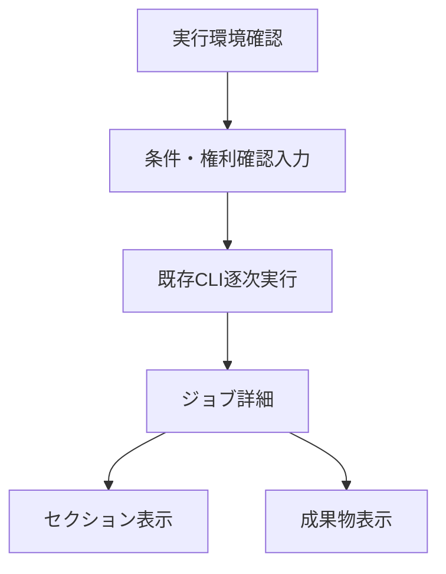
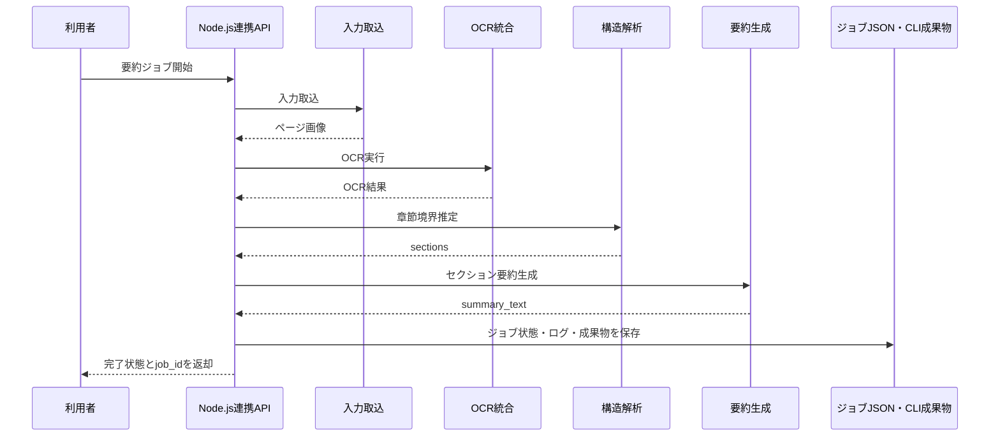
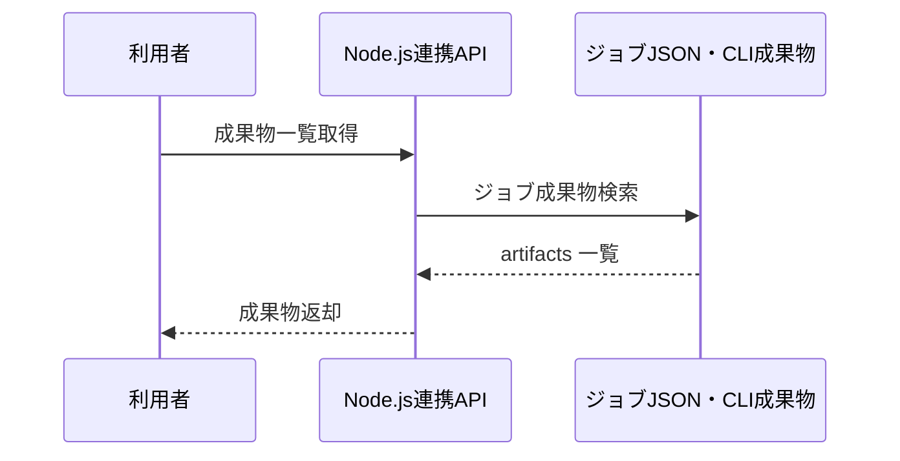

# System 15 基本設計
## 電子書籍 セクション別自動要約システム

---

## 1. システム構成設計

### 1.1 全体構成

```
StudyHub / ブラウザ
    ↓ HTTP（127.0.0.1:43715）
Node.jsローカル連携サービス
    ├─ POST /api/jobs（完了まで順次実行）
    ├─ GET /api/jobs
    ├─ GET /api/jobs/{job_id}
    ├─ GET /api/jobs/{job_id}/sections
    └─ GET /api/jobs/{job_id}/artifacts
    ↓ 子プロセス（shellなし）
book_summarization_cli
    ├─ CaptureAdapter
    ├─ PagePreprocessor
    ├─ OCRFusionService
    ├─ StructureAnalyzer
    ├─ VisualAnalyzer
    ├─ SummaryGenerator
    └─ ArtifactManager
    ↓
永続化（CLI成果物 + 連携サービスのジョブJSON）
```

### 1.2 コンポーネント一覧

| コンポーネント | 役割 |
|---|---|
| system15連携サービス | 入力検証、CLI起動、ジョブJSON・実行ログ・成果物参照API |
| CaptureAdapter | リーダー画面キャプチャ / PDF / 画像取込 |
| PagePreprocessor | ページ画像前処理、ノイズ除去 |
| OCRFusionService | VLM OCR と Tesseract の統合 |
| StructureAnalyzer | TOC 検出、セクション境界判定 |
| VisualAnalyzer | Detectron2 / VLM による図表解析 |
| SummaryGenerator | セクション本文 + 図表説明から要約生成 |
| ArtifactManager | 中間成果物と最終成果物の保存 |

---

## 2. 主要設計方針

### 2.1 パイプライン設計

- フェーズは `取込 → OCR → 構造解析 → 図表処理 → 要約生成` の順で固定する
- phase ごとに成果物を保存し、途中失敗時に再開できるようにする
- CLI本体の既存タスクを対象番号順に実行し、StudyHub用の簡易処理へ置き換えない
- ジョブを一件ずつ実行し、一件の完了後に次を受け付ける

### 2.2 永続化方針

- 画像、OCR テキスト、図表切り抜き、JSONL を成果物ディレクトリへ保存する
- 連携サービスのジョブ状態とログは`.runtime/jobs/{job_id}/job.json`へUTF-8で保存する
- section / visual / OCR /要約は既存CLIの成果物ディレクトリを正本とする

---

## 3. IF仕様

### 3.1 エンドポイント一覧

| メソッド | パス | 役割 | 応答方式 |
|---|---|---|---|
| GET | `/health` | CLI本体と設定ファイルの存在確認 | 即時応答 |
| GET | `/api/jobs` | 保存済みジョブ一覧 | 即時応答 |
| POST | `/api/jobs` | 要約ジョブを一件ずつ実行 | 完了後にHTTP 200 |
| GET | `/api/jobs/{job_id}` | 保存済みジョブ状態確認 | 即時応答 |
| GET | `/api/jobs/{job_id}/sections` | セクション一覧取得 | 即時応答 |
| GET | `/api/jobs/{job_id}/artifacts` | 成果物一覧取得 | 即時応答 |

### 3.2 入力種別

- `capture`
- `pdf`
- `image_dir`

---

## 4. 処理フロー

### 4.1 ジョブ全体

```
ジョブ受付
  ↓
入力形式判定
  ↓
ページ画像生成
  ↓
OCR 融合
  ↓
TOC / セクション解析
  ↓
図表検出・説明文生成
  ↓
セクション要約生成
  ↓
artifacts 保存
```

### 4.2 OCR 融合

```
VLM OCR 実行
  ↓
Tesseract OCR 実行
  ↓
bbox 重複除去
  ↓
読み順統合
  ↓
信頼度算出
```

---

## 5. データ設計

| 論理モデル | 主な保持内容 |
|---|---|
| `.runtime/jobs/{job_id}/job.json` | 入力、状態、phase、ページ数、ログ、成果物一覧、作成・更新・完了日時 |
| CLIページ成果物 | 画像、OCR、構造解析などのページ単位ファイル |
| CLIセクション成果物 | セクション識別子、タイトル、Markdown要約、保存先 |
| CLI図表成果物 | 切り抜き、説明、索引などCLIが生成したファイル |

### 5.1 保存方針

- 大容量データとメタデータは既存CLIのファイル配置を再利用する
- 連携サービスはCLIの保存先を列挙し、成果物を複製しない

---

## 6. プロンプト・AI制御設計

### 6.1 AI処理

| 処理 | 用途 |
|---|---|
| VLM OCR補助 | 本文・見出し・キャプション抽出 |
| セクション判定 | 目次と OCR を使った境界判定 |
| 図表説明生成 | visual description 作成 |
| セクション要約 | 本文 + 図表説明の統合要約 |

### 6.2 出力ルール

- 読めない箇所は推測で補完しない
- セクション境界は confidence_score を必ず付ける
- 図表説明は本文との対応が曖昧ならその旨を明示する

---

## 7. ガードレール・エラー処理設計

- 著作権フリーまたは利用許諾済み書籍のみ対象とする
- DRM 付きコンテンツは処理対象外とする
- タイムアウトしたページや図表は quarantine 扱いにして残り処理を継続する
- 低信頼 section は `review_required=true` として返す

---

## 8. 非機能・運用設計

- ジョブはHTTP要求内で一件ずつ順次実行し、phase状態とログを処理途中にも保存する
- 中間成果物を残して再実行時間を短縮する
- 1 ページごとの処理時間、OCR 信頼度、section 信頼度をトレースする

---

## 9. 技術スタック

| 用途 | 技術 |
|---|---|
| StudyHub連携API・画面 | Node.js HTTP、HTML、CSS、JavaScript |
| CLI起動 | Node.js `child_process.spawn`（shellなし） |
| OCR・VLM・画像処理 | `book_summarization_cli`の設定と実装 |
| PDF取込 | 連携サービスの`pdf2image`呼出し + CLI |
| 保存 | ジョブJSON、実行ログ、CLI成果物ファイル |

## 10. 画面一覧

| 画面名 | 目的 | 備考 |
|---|---|---|
| 電子書籍セクション別自動要約画面 | 実行環境、条件入力、逐次処理、ジョブ一覧、選択ジョブ、セクション、成果物を一画面で扱う | StudyHubから起動 |

## 11. 権限制御

| ロール | 利用可能画面 | 主要操作 |
|---|---|---|
| ローカル利用者 | 電子書籍セクション別自動要約画面 | 権利確認、ジョブ実行、保存済み結果閲覧 |

## 12. 主要導線

- 実行導線: 条件と権利確認を入力して処理を開始し、完了応答後にジョブ詳細を確認する。
- 成果物導線: 選択ジョブの「セクションを表示」「成果物を表示」で保存済み結果を確認する。

## 13. 画面遷移図



- CLI処理の完了後にジョブ詳細を表示し、必要に応じてセクションまたは成果物を表示する。

## 14. 画面項目定義
### 14.1 要約ジョブ実行画面

| 項目ID | 項目名 | UI種別 | 必須 | 備考 |
|---|---|---|---|---|
| `input_type` | 入力種別 | 選択 | ○ | 画像フォルダー/PDF/キャプチャ |
| `input_path` | 入力パス | テキスト | PDF・画像時○ | ローカルパス |
| `book_id` | 書籍ID | テキスト | ○ | 許可文字のみ |
| `max_pages` | 最大ページ数 | 数値 | ○ | 1〜5000 |
| `resume` | 完了済み処理を再利用 | チェック |  | CLIの再開指定 |
| `enable_visual_extraction` | 図表抽出・説明 | チェック |  | CLIの図表処理指定 |
| `rights_confirmed` | 利用権限確認 | チェック | ○ | 未確認時は開始不可 |
| `submit_job` | ジョブを開始 | ボタン | ○ | POST `/api/jobs` |
| `form-message` | 実行状態 | ステータス表示 |  | 完了応答まで処理中を表示 |

### 14.2 セクション要約画面

| 項目ID | 項目名 | UI種別 | 備考 |
|---|---|---|---|
| `jobs` | ジョブ一覧 | 一覧 | GET `/api/jobs` |
| `job-detail` | 選択ジョブ | JSON表示 | GET `/api/jobs/{job_id}` |
| `show-sections` | セクションを表示 | ボタン | GET `/api/jobs/{job_id}/sections` |

### 14.3 成果物画面

| 項目ID | 項目名 | UI種別 | 備考 |
|---|---|---|---|
| `show-artifacts` | 成果物を表示 | ボタン | GET `/api/jobs/{job_id}/artifacts` |
| `result-detail` | セクション／成果物 | JSON表示 | CLIに保存された実データ |

## 15. シーケンス図
### 15.1 要約ジョブ実行



### 15.2 成果物取得



